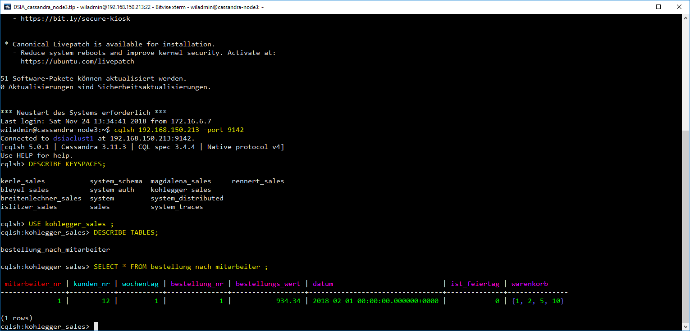
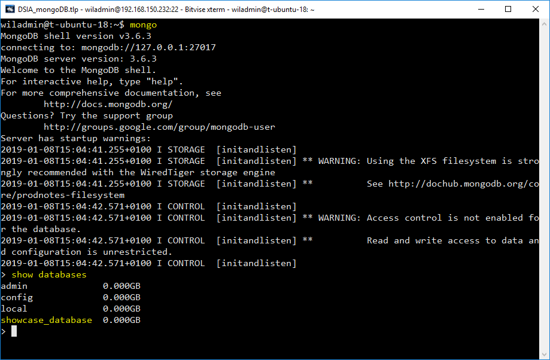

# DBS Interaktion

Hier fasse ich euch noch einmal kurz und knapp zusammen, auf welche Weise ihr mit unseren DBS interagieren könnt. Dabei müssen wir zwischen unterschiedlichen DBS trennen.

## Microsoft SQL Server

SQL Server ist ein DBS, das nach relationalen Grundsätzen arbeitet und wird von Microsoft vertrieben. SQL Server ist in unterschiedlichen Ausführungen am Markt erhältlich z.B. SQL Server Express (offene Version, nur relationale DBs, nutzt max. 1GB RAM) SQL Server Developer (vollständiger Funktionsumfang, "nur" zum Experimentieren), SQL Server Enterprise (vollständiger Funktionsumfang, für professionellen Einsatz).
>Wir haben uns mit SQL Server nur aus der Not heraus beschäftigt, weil wir nicht auf unsern MySQL Server zugreifen konnten.

### SQL Server Management Studio

Microsoft bietet passend zu seinem SQL Server das SQL Server Management Studio an. Diese Anwendung erlaubt es euch mit dem Server via SQL (und teilweise auch über grafische) Oberflächen zu interagieren.


### Python ```pyodbc```

Wenn ihr eure Daten auf einem SQL Server liegen habt, eure Analysen aber in Python machen wollt, könnt ihr euch die Daten auch direkt in Python laden. Dazu nutzen wir die ODBC-Schnittstelle (Open Database Connection) unseres SQL Servers, die wir mit Hilfe der ```pyodbc``` Bibliothek ansprechen können.

Installieren könnt ihr ```pyodbc``` direkt über pip, wenn ihr folgende Sequenz auf eurer Kommandozeile (Windows) bzw. in eurem Terminal (wenn ich auf Mac oder Linux seid) ausführt:

```shell
pip install pyodbc
```

Unterhalb habe ich euch beispielhaft eine Code-Schnipsel eingefügt, das eine Komplette Konversation mit meinem lokalen SQL Server zeigt.

```python
import pyodbc

# The so called connection string holds all the information about the DBS
connection_string = 'DRIVER={SQL Server};SERVER=L1-KOHMIC-01;DATABASE=sales'

# The connect method contacts the server and keeps the contact alive
connection = pyodbc.connect(connection_string)

# The cursor is just a vehicle that we use to pass our queries and return results
cursor = connection.cursor()

# The execute method does the actual query work for us
# You can feed any SQL statement to that method (also DML and/or DDL statements)
cursor.execute("SELECT * FROM sales.dbo.artikel AS a WHERE a.preis < 500;")

# The cursor object holds all the results in form of an iterable that we can iterate now
for row in cursor.fetchall():
    print(row)

# Closing cursor and connection ends the overall communication with the server
cursor.close()
connection.close()
```

## MySQL

MySQL ist, wie SQL Server, ein DBS, das nach relationalen Printzip funktioniert und wird von Oracle vertrieben. Auch MySQL kann in unterschiedlichen Ausführungen betrieben werden. Das umfasst einerseits das Lizenzmodell, aber andererseits auch die [Engine](https://dev.mysql.com/doc/refman/8.0/en/storage-engines.html), die der MySQL Server verwendet um seine Daten zu managen (die populärsten Engines sind MyISAM, InnoDB, Memory, Blackhole).

### MySQL **Workbench**

Die Workbench ist - ähnlich wie SQL Server Management Studio - eine eigenständige Software, die es euch erlaubt mit MySQL zu interagieren. Zusätzlich zu SQL unterstütz sie euch auch durch eine grafische Benutzeroberfläche. Manche Dinge könnt ihr so auch ohne SQL-Script einstellen.


### **Python** via ```mysql.connector```

Diese Option ist wunderbar geeignet, wenn ihr Daten aus einem DBS laden wollt, um diese direkt in Python weiter zu verarbeiten. Mit Hilfe des ```mysql.connector``` ist das sehr einfach. Ihr könntet auch ```pyodbc``` (siehe oben) verwenden, da auch MySQL über eine Open Database Connection (ODBC) Schnittstelle verfügt. ```mysql.connector``` ist aber vor allem deshalb so praktisch, weil ihr euch dort die ganze Driver-Info sparen könnt - das Ding funktioniert eben nur mit MySQL.

So könnt ihr ```mysql.connector``` auf eurem System installieren:

 ```shell
pip install mysql-connector
 ```

Und so könnte ein beispielhafter Datenabruf aussehen. Hier verbinde ich mich übrigens mit unserem DSIA-MySQL-Cluster im Lab. Ihr könnt natürlich je nach Anwendungsfall der ```connect```-Methode andere Attribute übergeben...

```python
import mysql.connector as mc

# The connect method contacts the server and keeps the contact alive
connection = mc.connect(
    host='80.93.46.242',
    port=3306,
    user='db',
    passwd="Qwertzuiop123456!"
)

# The cursor is just a vehicle that we use to pass our queries and return results
cursor = connection.cursor()

# The execute method does the actual query work for us
# You can feed any SQL statement to that method (also DML and/or DDL statements)
cursor.execute("SELECT * FROM sales.artikel AS a WHERE a.preis < 500;")

# The cursor object holds all the results in form of an iterable that we can iterate now
for row in cursor:
    print(row)

# Closing cursor and connection ends the overall communication with the server
cursor.close()
connection.close()

```

### Terminal (Unix) bzw. Kommandozeile (Windows)

Das ist, sozusagen, die Basisoption, die euch immer bleibt. Sobald ihr auf einem Rechner (eigener Rechner oder auch Server) MySQL aufsetzt, wird auch der shell-Client mitinstalliert. Dieser erlaubt es euch, mit dem MySQL-Server direct auf der Kommandozeile eures jeweiligen Systems zu interagieren. Unterhalb bin ich etwa gerade mit dem Node01 unseres MySQL Clusters verbunden und führe direkt im Terminal eine SQL Abfrage aus.

Das CLI (command line interface) von MySQL kann am Hostrechner (der Rechner, auf dem der MySQL-Service läuft) mit folgendem Befehl im Terminal/Kommandozeile aufgerufen werden:

```shell
mysql -u {username} -p
```


## Apache Cassandra

Apache Cassandra ist ein Wide-Column Store. Wir verwenden Cassandra um strukturierte Daten zu speichern, verzichten hier aber auf JOINS (wie sie im relationalen Modell vorkommen). In Cassandra arbeiten wir deshalb mit (mehr oder weniger) großen Einzeltabellen.

### Python via ```dse```

Der ```dse``` (DataStaxx Enterprise) driver wird von DataStaxx für die interaktion mit Apache Cassandra zur Verfügung gestellt und folgt beim Interaktionsablauf dem Modell anderer DBS-driver (z.B. ODBC). 

So könnt ihr ```dse``` auf eurem System installieren. **Achtung:** Derzeit (2018-11-24) ist der driver offensichtlich nicht mit der aktuellen Version von Python (3.7) kompatibel. Deshalb muss der driver unter Python 3.5 oder 3.6 installiert werden.

```shell
pip install dse-driver
```

```python
from dse.cluster import Cluster

# We first create a new instance of the Cluster class
cluster = Cluster(['80.93.46.242'], port=3308)

# Next, we instantiate a connection object by calling the connect method of Cluster
connection = cluster.connect()

# Then we define the query we want to send
query = "SELECT * FROM kohlegger_sales.bestellung_nach_mitarbeiter;"

# ... and execute it on our connection object
rows = connection.execute(query)

# Here we iterate over the rows object to print the single records
for element in rows:
    print(element)

# Finally, we close the connection using the Cluster's shutdown method
connection.shutdown()
```

### Terminal (Unix) bzw. Kommandozeile (Windows)

Ähnlich wie in MySQL gibt es auch in Cassandra ein einfaches CLI (command line interface), das wir verwenden können um direkt am Server mit unserem Cluster zu interagieren.

Das CLI von Cassandra kann am Hostrechner (der Rechner, auf dem der Cassandra-Service läuft) mit folgendem Befehl im Terminal/Kommandozeile aufgerufen werden (hier am Beispiel des Rechners mit der IP ```192.168.150.213``` und dem Port ```9142```):

```shell
cqlsh 192.168.150.213 -port 9142
```



## Neo4J

Neo4J ist ein Graphen-DB (GDB) System. Anstelle von Tabellen verwendet dieses System Graphen, um Daten zu repräsentieren. Ein Graph ist eine netzartige Struktur aus Knoten (aka "Vertex") und Relationen (aka "Kante"/"Edge" bzw. "Arc" wenn mit Richtungssinn) . Knoten repräsentieren dabei Objekte, über die Daten erfasst werden sollen. Darin unterscheidet sich das Graphen-Konzept noch wenig vom relationalen oder Wide-Column-Modell. Beziehungen verbinden Knoten miteinander. Sowohl Knoten, als auch Relationen können typisiert werden.


GDBs sind besonders dann geeignet, wenn der Speicher- und Analysefokus insbesondere auf Beziehungen zwischen Datenobjekten liegt. RDBs können zwar graphenartige Datenstrukturen abbilden. Die Auswertung dieser Datenstrukturen ist aber komplizierter.

### Neo4J Browser

Neo4J bietet passend zum Neo4J Server einen Web-basierten Browser, der zur Datenbankinteraktion verwendet werden kann. Mit dieser Anwendung könnt ihr Cypher-Abfrage verfassen und abschicken. Neben der Standardausgabe verfügt der Browser über eine Rendering-Engine für Graph-Daten (siehe Screenshot).


### Python ```neo4j```

Wenn ihr eure Daten auf einem Neo4J Server liegen habt, eure Analysen aber in Python machen wollt, könnt ihr euch die Daten auch direkt in Python laden. Dazu nutzen wir die Bolt-Schnittstelle unseres Servers und die ```neo4j``` Bibliothek. Im vergleich zu anderen Python-Bibliotheken ist die Struktur hier aber vor allem durch die Verwendung von Dekorator-Functions geprägt.

Installieren könnt ihr ```neo4j``` direkt über pip, wenn ihr folgende Sequenz auf eurer Kommandozeile (Windows) bzw. in eurem Terminal (wenn ich auf Mac oder Linux seid) ausführt:

```shell
pip install neo4j
```

Unterhalb habe ich euch beispielhaft eine Code-Schnipsel eingefügt, das eine Komplette Konversation mit meinem lokalen SQL Server zeigt.

```python
from neo4j import GraphDatabase
from getpass import getpass

# First we create an instance of the GraphDatabase Object using the driver function
my_auth = ("username", "passwort")
uri = "bolt://80.93.46.242:3311"
driver = GraphDatabase.driver(uri, auth=my_auth)


# We define a function that is specifically tailored towards a paricular analysis scenario (here: We are searching for Persons [pa] that are in an interacts_with relationship with a Person [pb]. We are additionally restricting the output to person that match the given input-name)
def print_friends_of(tx, name_input):
    match_list = tx.run('MATCH (pa:Person)-[:Interact_with]->(pb:Person) WHERE pb.name = "{}" RETURN pa.name'.format(name_input))
    for record in match_list:
        print(record["pa.name"])

# We are handing the function and Search name to the driver session.
with driver.session() as session:
    session.read_transaction(print_friends_of, "Jack")
```

## MongoDb

### Robomongo

Robomongo ist ein vollwertiger Admin-Client, der es euch erlaubt mit einem MongoDB-Server zu kommunizieren, diesen zu administrieren und Abfragen zu schicken. Er verfügt, wie andere DBS-Clients auch, über eine grafische Oberfläche und einen Objekt-Explorer (siehe Screenshot).


### Python ```pymongo```

Mit Hilfe der ```pymongo``` Bibliothek könnt ihr MongoDB auch von Python aus verwalten. Die Interaktion läuft ähnlich, wie bei anderen DBS-Bibliotheken ab. Größter Unterschied ist aber sicherlich, dass weder Datenbanken, noch Collections bewusst erzeugt werden müssen. Stattdessen werden diese angelegt, wenn ihr sie verwendet und sie bisher noch nicht existieren.

Installieren könnt ihr ```pymongo``` direkt über pip, wenn ihr folgende Sequenz auf eurer Kommandozeile (Windows) bzw. in eurem Terminal (wenn ich auf Mac oder Linux seid) ausführt:

```shell
pip install pymongo
```

Unterhalb habe ich euch beispielhaft eine Code-Schnipsel eingefügt, das eine Komplette Konversation mit einem remoten MongoDB Server zeigt.

```python
from pymongo import MongoClient

# Hier spezifiziere ich ein JSON Objekt
json_object = {
    "name": "Michael", 
    "nname": "Kohlegger", 
    "hobbies": ["Laufen", "Lesen"]
}

# Als nächstes verbinden wir uns mit unserem MongoDB-Server und wählen DB & Collection
server = MongoClient(host="80.93.46.242", port=3313)
database = server["de01_kohlegger_db"]
collection = database["mega_tutorial"]

# Hier fügen wir unser JSON Objekt ein
collection.insert(json_object)

# Zum Schluss können wir unsere Daten z.B. wie folgt abfragen.
results = collection.find()
for result in results:
    print(result)

# Zuletzt schließen wir die Session mit dem Server
server.close()
```

### Terminal (Unix) bzw. Kommandozeile (Windows)

Ähnlich wie in MySQL und Cassandra gibt es auch bei MongoDB ein einfaches CLI (command line interface), das wir verwenden können um direkt am Server mit unserem Cluster zu interagieren. 

Das CLI von MongoDB kann am Hostrechner (der Rechner, auf dem der MongoDB-Service läuft) mit folgendem Befehl im Terminal/Kommandozeile aufgerufen werden (hier am Beispiel des Rechners mit der IP ```192.168.150.232```):

```shell
mongo
```


