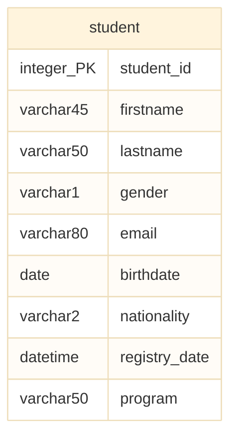

# Entitätstypen in SQL

Entitätstypen sind Personen oder Objekte, über die wir Daten erfassen wollen. Bei der Modellierung eines bestimmten Szenarios überlegen wir uns genau, welche Entitätstypen wir benötigen, um einen bestimmten Sachverhalt abzubilden und beschreiben diese anschließend mit Hilfe von geeigneten Attributen.

## Modellieren von Entitätstypen

Unterhalb haben wir das Modell eines einfachen Entitätstyps - `student` - eingefügt. Studenten werden in diesem Modell durch eine Reihe von Attributen näher beschrieben. Dazu gehören z.B. der Vorname, der Nachname oder das Datum, an dem die Student*in in der Datenbank erfasst worden ist. Andere Attribute, die zweifelsohne auch bei Student*innen beobachtet werden können (z.B. die Haarfarbe oder die Körpergröße), die aber in unserer Studierendendatenbank keine Rolle spielen, werden jedoch nicht im Modell erfasst. Die zu erfassenden Attribute hängen also direkt vom jeweiligen Modellierungskontext ab.

In diesem Buch arbeiten wir mit einer vereinfachten Darstellungsform, die auf der Crow's Foot Notation basiert. Hier werden Entitätstypen und Attribute dargestellt, der Primärschlüssel jedoch nicht gesondert markiert. Anstelledessen werden aber die Datentypen bereits im Modell dargestellt (siehe unterhalb). In der Linken Spalte der Entitätstyp-Box steht der Datentyp, in der rechten Spalte der Titel des jeweiligen Attributs.

> **Hinweis:** Zur besseren Lesbarkeit wird in diesem Buch beim Datentyp des Primärschlüsselattributs der Zusatz `_PK` hinzugefügt. Außerdem wird das Primärschlüsselattribut stets so benannt, wie der Entitätstyp für den es gesetzt wurde. Dem Attriutnamen wird darüber hinaus immer die Endung `_id` begefügt.



## Umsetzung von Entitätstypen

Bei der Umsetzung einer Datenbank wird aus jedem Entitätstyp unseres Modells eine eigene Tabelle. Diese können wir mit Hilfe von `CREATE TABLE` erzeugen. Zuerste erstellen wir mit Hilfe der Statements unterhalb eine neue Datenbank und nehmen diese anschließend mit `USE` in Verwendung.

```sql
create database university;
use university;
```

Bei der Tabellenerstellung müssen wir dann darauf achten, dass nicht bereits eine gleichnamige Tabelle in der Datenbank existiert. Darum führen wir im Beispiel unterhalb zuerst ein `DROP TABLE` Statement aus und erzeugen die Tabelle erst anschließend. Mit Hilfe von `if exists` bzw. `if not exists` stellen wir sicher, dass das Statement nur dann ausgeführt wird, wenn die Tabelle existiert bzw. nicht existiert.

```sql
drop table if exists student;
create table if not exists student (
    student_id int auto_increment primary key,
    firstname varchar(45),
    lastname varchar(50),
    gender varchar(1),
    email varchar(80),
    birthdate date,
    nationality varchar(2),
    registry_date datetime,
    program varchar(50)
);
```

Das vollständige Beispiel (inklusive Beispieldaten) könnt ihr euch 📁 [hier herunterladen](../downloads/student.sql).
