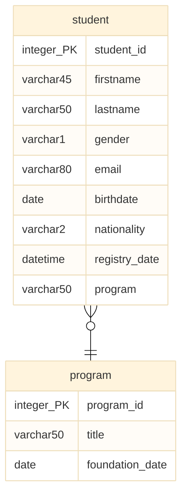

# 1:n-Beziehungstyp

Wir haben gesehen, dass es notwendig sein kann, Datenstrukturen in mehrere Tabellen zu zerlegen. Das ist z.B. dann der Fall, wenn wir ohne diese Teilung Datenredundanz in Kauf nehmen müssten. Hier spielt insbesondere das Thema Normalisierung eine große Rolle.

## Modellierung

In der Modellierung berücksichtigen wir eine Aufteilung von Datenstrukturen, indem wir mehrere Entitätstypen im Modell vorsehen und diese dann mit Hilfe von Beziehungen miteinander verbinden. Im Beispiel unterhalb haben wir z.B. das Student Modell aus unserem [Single-Entity-Tutorial](entity.md) bereinigt. Dort kam noch das Attribut `program` vor. Dieses Attribut verweist auf den Studiengang, zu dem eine Student*in zugordnet ist. Solange wir hier nur den Studiengangsname erfassen wollen, wäre das kein großes Problem. Würden wir aber außerdem das Gründungsdatum von Studiengängen erfassen wollen, würde der Entitätstyp `student` gegen die dritte Normalform verstoßen (weil das Gründungsdatum vom Studiengang abhängig ist, der wiederum von der Student*in abhängt - Transitive Abhängigkeit).

Hier wäre es nun klug, für den Studiengang einen eigenständigen Entitätstyp vorzusehen und diesen somit von `student` zu trennen. Im Modell unterhalb ist das passiert, indem wir die beiden Entitätstypen als separate Boxen dargestellt haben, die jeweils ihre konkreten Attribute enthalten. Außerdem wurde im Modell eine Kante zwischen den beiden Rechtecken eingefügt, die auf deren Verbindung verweist. Die Symbole an den Enden dieser Kante beschreiben dabei dei Kardinalität (Außenseite) und die Konditionalität (Innenseite).



Die Bedeutung dieser beiden Konzepte kann wie folgt beschrieben werden:

* Die **Kardinalität** gibt an, wieviele Entitäten eines Entitätstyps *maximal* an einer Beziehung beteiligt sein können.
* Die **Konditionalität** gibt an, wieviele Entitäten eines Entitätstyps *mindestens* an einer Beziehung beteiligt sein müssen.

Zur Ermittlung von Kardinalität und Konditionalität empfiehlt sich eine Einfache Mengendarstellung, bei der alle möglichen Fälle geprüft werden können. Die Darstellung unterhalb zeigt, dass ein Studiengang mit mehreren Studierenden in Beziehung stehen kann. Umgekehrt kann jede Studierende nur einem Studiengang zugeordnet sein. Daraus ergeben sich die Kardinalitäten der Beziehungsenden. Der "Krähenfuß" (oben, mittig) im Diagram steht für die von rechts nach links auseinanderlaufenden Kanten im Mengendiagram und kann parallel in das Datenmodell übertragen werden.


Zuletzt bleibt noch die Frage, ob es auch Studierende Geben kann (gelber Kreis), die keinem Studiengang zugeordnet sind dürfen; und ob es Studiengänge geben kann (oranger Kreis), denen keine Studierenden zugeordnet wurden. Falls es solche Entitäten geben kann, wird das im Modell als Null-Konditionalität (Kreis, wie bei Student im Modell) dargestellt. Wenn jede Entität zwingend einer Entität der der anderen Menge zugeordnet sein muss (also kein alleinstehender Knoten möglich ist), wird das durch eine 1-Konditionalität im Modell dargestellt (Strich, wie bei program im Modell).

## Implementierung

Bevor wir wieder mit unseren Tabellen Loslegen können, erzeugen wir eine Datenbank und nehmen diese in Verwendung.

``` sql
drop database if exists university;
create database if not exists university;
use university;
```

Anschließend erzeugen wir die `program` Tabelle. Das ist wichtig, weil die `student` Tabelle später auf `program` verweisen wird. Darum muss die `program` Tabelle zuerst erzeugt werden.

``` sql
drop table if exists program;
create table if not exists program (
	program_id int auto_increment primary key,
	title varchar(50),
    founding_date date
);
```

Zuletzt erzeugen wir die `student` Tabelle. Hier stehen besonders die letzten drei Zeilen im Vordergrund, denn hier wird der Fremdschlüssel umgesetzt, der die `student` Tablle mit der `program` Tabelle in Beziehung setzt.

Das Umsetzen des Fremdschlüssels erfolgt dabei immer in drei Schritten:
1. **Attribut erzeugen**, das den Fremdschlüssel hält (`program_id int`)
2. **Attribut zum Foreignkey** erheben (`foreign key (program_id)`)
3. **Bezugsspalte angeben**, auf die der Fremdschlüssel verweist (`references program (program_id)`)

Beim ersten dieser Schritte muss zudem beachtete werden, dass der Datentyp des Fremdschlüsselattributs identische sein muss wie der Datentyp des referenzierten Primärschlüsselattributs in der Nachbarstabelle. Nur so ist sichergestellt, dass auch alle möglichen Werte der Primärschlüsselspalte als Fremdschlüsselwert gewählt werden können.

``` sql hl_lines="11 12 13"
drop table if exists student;
create table if not exists student (
    student_id int auto_increment primary key,
    firstname varchar(45),
    lastname varchar(50),
    gender varchar(1),
    email varchar(80),
    birthdate date,
    nationality varchar(2),
    registry_date datetime,
    program_id int,
    foreign key (program_id)
    references program (program_id)
);
```

Das vollständige Beispiel (inklusive Beispieldaten) könnt ihr euch 📁 [hier herunterladen](../downloads/student_program.sql).
