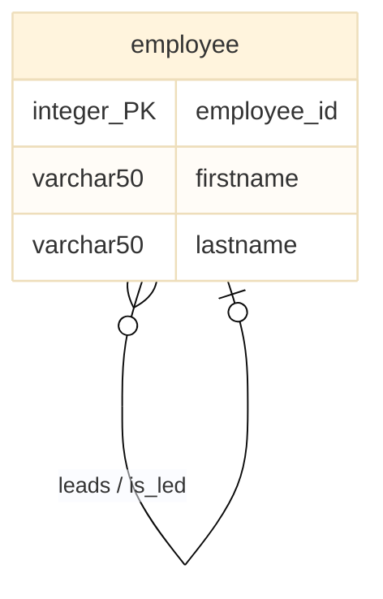

# Common Table Expression

Mit Hilfe der Common Table Expression ist es Möglich Views zu erstellen, die nur in der Laufzeit der Abfrage existieren (also anders als klassische Views nicht gespeichert werden). Diese Views haben aber auch eine zweite wichtige Eigenschaft: Sie können rekursiv aufgerufen werden. In MariaDB kann so ein View mit Hilfe der `with recursive` Klausel erzeugt werden.

## Beispiel Datenbank

Unterhalb erzeugen wir zuerst eine Simple Datenbank, die einen Entitätstyp enthält, der mit sich selbst in Beziehung steht. Die Beziehung bildet folgende Mitarbeiter*innen-Hierarchie ab:


```sql
create database human_resource;
use human_resource;

create table employee (
    employee_id int auto_increment primary key,
    firstname varchar(50),
    lastname varchar(50),
    boss_id int,
    foreign key(boss_id)
    references employee(employee_id)
);
```

Im Modell würde die hier abgebildete Datenbank wie folgt aussehen. Auch hier ist zu beachten, dass der Fremdschlüssel `boss_id` nicht im Modell dargestellt wird.



## Rekursivbeziehung abfragen (Eine Ebene)

Nun wollen wir die Ebenen der Hierarchie abwandern und ermitteln, welche Mitarbeiter*innen sich auf welcher Hierarchieebene befinden. Das ist in der Praxis aber gar nicht so einfach.

Es fällt uns leicht, zwei aneinander angrenzende Ebenen der Hierarchie Abzufragen. Das können wir machen, indem wir die Tabelle mit sich selbst durch einen `JOIN` verbinden. So können wir die Bossebene und die Ebene der direkten Untergebenen abbilden.

```sql
select boss.lastname, emp.lastname
from employee as boss
join employee as emp
    on emp.boss_id = boss.employee_id;
```

## Rekursivbeziehung abfragen (Mehrere Ebenen)

Das funktioniert zwar gut, aber wir sehen immer nur welche Person, welcher anderen Person übergeordnet/untergeben ist. Was wir hieraus nur schwer rekonstruieren können, ist die Gesamthierarchie. Wir sehen hier z.B. nicht, welche Mitarbeiter*in sich auf welcher Ebene der Hierarchie befindet und wieviele Ebenen unsere Hierarchie überhaupt hat. Das müssen wir uns nach wie vor aus den Ergebnissen mühsam zusammensuchen.

Natürlich wäre es möglich, das oben gezeigte Statement um zusätzliche Ebenen zu erweitern und so die Hierarchie abzubilden. Im Statement unterhalb würden wir nun z.B. drei aneinander angrenzende Level der Hierarchie sehen. Wenn unsere Hierachie aber tatsächlich vier Level tief ist, sehen wir dennoch nicht alles.

```sql
select top_level.lastname, mid_level.lastname, bottom_level.lastname
from employee as top_level
join employee as mid_level
    on mid_level.boss_id = top_level.employee_id
join employee as bottom_level
    on bottom_level.boss_id = mid_level.employee_id;
```

**Was ist hier unser Problem?** Unser Problem hier ist, dass unser SQL-Statement an die Hierarchie angepasst werden muss. Abhängig davon, wieviele Ebenen diese Hierarchie hat, müssen wir mehr oder weniger `JOIN` Operationen in unser Statement einbauen. Hat die Hierarchie fünf Ebenen, brauchen wir die ``employee``-Tabelle fünfmal. Hat die Hierarchie 12 Ebenen, brauchen wir die ``employee``-Tablle 12 mal usw..

## Rekursivbeziehung abfragen (Alle Ebene)

Hier kommt nun die **Common Table Expression** ins Spiel. Mit Hilfe dieses SQL-Konstrukts, können wir unsere Hierarchie abwandern, ohne die Tiefe der Hierarchie bereits zu kennen. Das erreichen wir, indem wir das CTE-Statement rekursiv aufrufen können.

Im Beispiel unterhalb besteht der View im CTE aus zwei Teilen. Im ersten Teil ermitteln wir den Startpunkt unserer Hierarchie. Das sind jene Mitarbeiter*innen, die ganz oben stehen und selbst keine Vorgesetzte besitzen (`where boss_id is null`). Im zweiten Teil des Statements fügen wir dann alle Personen hinzu die auf der nächsten, darunterliegenden Ebene stehen. Hierzu rufen wir das CTE selbst wieder auf (`from recursive_view as parent`) und fügen die nächste Ebene mit Hilfe eines `JOIN` dazu. So bauen wir in mehreren Iterationen die Hierarchie auf.

Am ende des CTE kommt ein `select` welches das CTE zu guter letzt aufruft. Dadurch erfolgt dann die Ausgabe. Achtung: Dieser Aufruf ist zwingend erforderlich und muss immer unmittelbar hinter der `with`-Klausel folgen.

```sql
with recursive recursive_view as (

    select employee_id, lastname as employee, 0 as `level`
    from employee
    where boss_id is null

    union select child.employee_id, child.lastname, `level` + 1 as `level`
    from recursive_view as parent
    join employee as child
    on parent.employee_id = child.boss_id

)

select *
from recursive_view;
```

Das vollständige Beispiel (inklusive Beispieldaten) könnt ihr euch 📁 [hier herunterladen](../downloads/employee.sql).
